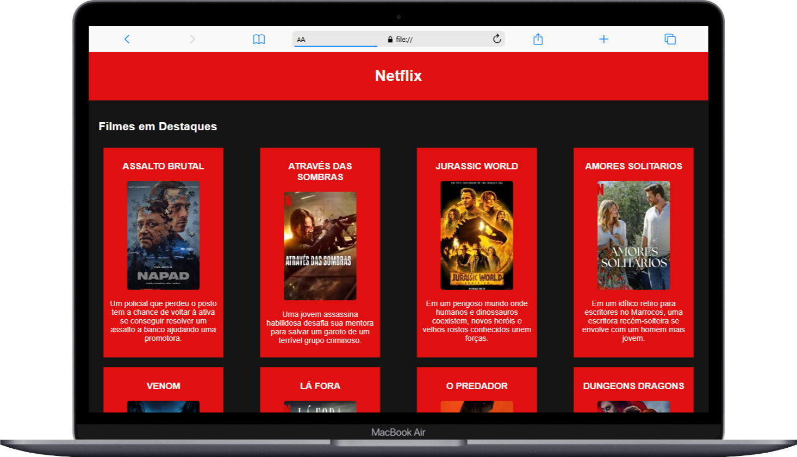

# Projetos HTML

O intuito deste repositório é melhorar as técnicas do HTML e CSS para fins didáticos , atividade Desenvolvida no Senai

    

    
    

[Acesse aqui](https://guime777.github.io/Web-Projetos/)

## Estrutura

- [x]  Estrutura HTML
- [x] Realizando primeiro commit
- [x] Realizando segundo commit
- [x] Enviando ao github

